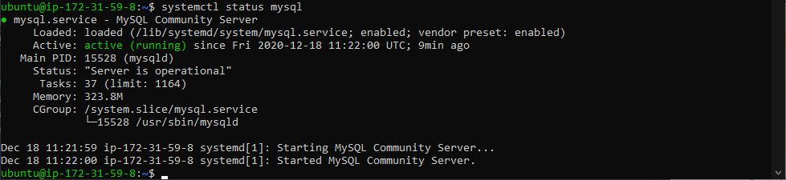

# Ejercicio 1. EC2
## ¿Qué es y para qué sirve EC2?
Amazon EC2 (Amazon Elastic Compute Cloud) proporciona capacidad de computación escalable en la nube de Amazon Web Services (AWS). El uso de Amazon EC2 elimina la necesidad de invertir inicialmente en hardware, puede lanzar tantos servidores virtuales como necesite, configurar la seguridad y las redes y administrar el almacenamiento. También es escalable, lo que le permite adaptarse a los picos de trafico reduciendo la necesidad de previsión (pagas lo que usas).

## comprobación:

# Ejercicio 2. Instalando aplicaciones
## ¿Qué es y para qué sirve EC2?
Amazon EC2 (Amazon Elastic Compute Cloud) proporciona capacidad de computación escalable en la nube de Amazon Web Services (AWS). El uso de Amazon EC2 elimina la necesidad de invertir inicialmente en hardware, puede lanzar tantos servidores virtuales como necesite, configurar la seguridad y las redes y administrar el almacenamiento. También es escalable, lo que le permite adaptarse a los picos de trafico reduciendo la necesidad de previsión (pagas lo que usas).

## comprobación:

# Ejercicio 3. IP elástica
## ¿Qué es y para qué sirve una IP Elástica?
Las direcciones IP elásticas son direcciones IPv4 estáticas diseñadas para la informática en la nube dinámica. Con una dirección IP elástica, se puede enmascarar los errores de una instancia o software volviendo a mapear rápidamente la dirección a otra instancia. Se asigna a una cuenta de AWS.

## comprobación:

# Ejercicio 4. DNS
## ¿Qué es y para qué sirve el DNS?
DNS (Domain Name System) es un sistema de nomenclatura jerárquico que se ocupa de la administración del espacio de nombres de dominio. Se encarga de traducir nombres legibles para las personas (la url) en identificadores binarios asociados con los equipos conectados a la red (la IP) y viceversa.
* Zona directa: traduce la url a una ip. Tipos de registros:
    1. **A**: traduce url a IPv4.
    1. **AAAA**: traduce url a IPv6.
    1. **CNAME**: crea nombres adicionales, alias, para los servidores de un dominio. Se puede usar para que un dominio apunte a otro dominio o subdominio, o para dar distintos nombres a los distintos servicios alojados bajo una misma ip. Apunta a registros A.
    1. **SRV**: proporciona información relacionada con los servicios disponibles para un determinado dominio.
    1. **MX**: identifica servidores de correo.
    1. **SOA**: especifica el servidor DNS primario del dominio, la cuenta de correo del administrador y tiempo de refresco de los servidores secundarios. **Solo puede haber uno** y suele ser definido por el proveesor de hosting.
    1. **TXT**: permite asociar información adicional a un dominio, como claves de registro.
    1. **NS**: define los servidores de nombres principales de un dominio. **Debe haber al menos uno**.
* Zona indirecta: truduce la ip a una url
    1. **SOA**
    1. **NS**
    1. **PTR**: traduce IP a url.

## comprobación:

1. El primer registro dice que el nombre grupo2.zerbitzaria.net esta asociado a la ip 54.76.1.76.
1. El segundo resitro dice que el correo mail.grupo2.zerbitzaria.net esta asociado al nombre grupo2.zerbitzaria.net
1. El tercer registro define la version de SPF a 1, autoriza el envio de correo si la direccion del cliente incluye spf.guebs.net y se encuentra en 54.76.1.76, si no se rechaza.

# Ejercicio 5. DNS
## ¿Cuántos servidores DNS existen?
13

## ¿Cuántas redirecciones DNS son posibles?
Las necesarias hasta encontrar una respuesta o llegar al DNS raíz sin una.

## ¿Qué son los servidores DNS Raíz?
Son los servidores DNS que responden las consultas de otros servidores DNS en vez de de usuarios(como hacen los DNS normales)

## ¿Para qué montar un servidor si simplemente escribiendo en un fichero la relación IP/Nombre el sistema ya funcionaría?
Para facilitar el uso de internet a los usuarios comunes, al actualizarse automaticamente.

## Según lo expuesto, y si en tu configuración de red del sistema operativo solamente posees un servidor DNS, entonces: ¿cuál sería el proceso para encontrar la IP de la dirección web: http://www.debian.org/distrib/netinst?
Primero comprobaria si la tiene guardada en la cache, después buscaría en el servidor encargado de .org, este le daría el servidor en el que se aloja www.debian.org y este le responde con la ip necesaria.

## ¿Es posible si dispones de una conexión a Internet con IP dinámica ofrecer servicios en Internet? Es decir, si quieres ofrecer los servicios SND, no dispones de IP estática, esto es, cada vez que te conectas a Internet tu IP, aunque a veces sea la misma, no siempre es la misma. 
Si es posible con un DDNS que se encargaria de mantener actulizada la información.

## ¿Qué es ICANN?
Internet Corporation for Assigned Names and Numbers (ICANN) es una organización sin fines de lucro que opera a nivel internacional, responsable de asignar espacio de direcciones numéricas de protocolo de Internet (IP), identificadores de protocolo y de las funciones de gestión [o administración] del sistema de nombres de dominio de primer nivel genéricos (gTLD) y de códigos de países (ccTLD), así como de la administración del sistema de servidores raíz.