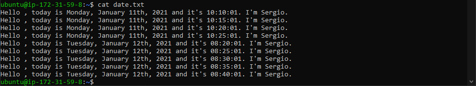

## script1
primero se crea script1.sh con el siguiente contenido
```
#! /bin/bash
echo `date "+Hello $USER, today is %A, %B %dth, %Y and it's %H:%M:%S. I'm Sergio."` >> date.txt
```

luego se le dan los permisos pertinentes
```
chmod 777 script1.sh
```

por último hay que introducir el comando `crontab -e` para abrir la configuracion de crontab y añadir:
```
*/5 * * * 1-5 /home/ubuntu/script1.sh
```

comprobación


## script2
primero se crea la carpeta en la que se meterán los backups
```
sudo mkdir /copias
```

luego se crea el script
```
#! /bin/bash
tar -cf /copias/copia.tar.gz /home/ubuntu
```

luego se le dan los permisos pertinentes
```
chmod 777 script1.sh
```

luego hay que introducir el comando `crontab -e` para abrir la configuracion de crontab y añadir:
```
*/15 * * * 2 /home/ubuntu/script2.sh
```